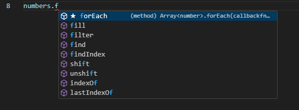
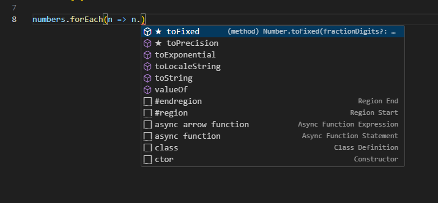

# Introduction

See https://www.youtube.com/watch?v=d56mG7DezGs

# Prerequisit
Node v 16.20.2

# Notes

## Introduction
- Typescript is a programming language to address shortcomings of JavaScript
- Benefits of typescript
    - Static typing. Types known at compile time, prevents errors.
    - Code completion
    - Refactoring
    - Shorthand notations
- Drawbacks of typescript
    - Compilation is needed
    - Discipline in code

Best practice: use typescript for medium to large project, java script for simple projects

## Development environment
- Install nodejs
- Use npm to install typescript globally
```bash
npm i -g typescript
```
- Verify typescript installation
```bash
# get typescript version
tsc -v
```
- Install visual code from https://code.visualstudio.com
- Write code in visual code for instance in index.ts
- Compile code
```bash
tsc index.ts
```
this generates index.js

## Configure typescript compiler
- Generate a typescript configuration file
```bash
tsc --init
Created a new tsconfig.json with:
  target: es2016
  module: commonjs
  strict: true
  esModuleInterop: true
  skipLibCheck: true
  forceConsistentCasingInFileNames: true


You can learn more at https://aka.ms/tsconfig
```
This generates tsconfig.json with configuration options

The target specifieds ES2016, which is supported by all browsers. Other choices are possible.

After setting input/output directory compiling only requires: ```tsc``` to compile all typescript files in the input directory and generate the javascript in the output directory.

### Usefull options
- noEmitOnError, do not generate javascript code on error.

## Debugging
For debugging the sourceMap feature in tsconfig must be set to true.
Generate a launch.json file for vscode to be able to debug
```json
{
    // Use IntelliSense to learn about possible attributes.
    // Hover to view descriptions of existing attributes.
    // For more information, visit: https://go.microsoft.com/fwlink/?linkid=830387
    "version": "0.2.0",
    "configurations": [
        {
            "type": "node",
            "request": "launch",
            "name": "Launch Program",
            "skipFiles": [
                "<node_internals>/**"
            ],
            "program": "${workspaceFolder}/src/index.ts",
            "preLaunchTask": "tsc: build - tsconfig.json",
            "outFiles": [
                "${workspaceFolder}/**/*.js"
            ]
        }
    ]
}
```

## Fundamentals
Fundamental concepts of typescript buildin types are:
- any type
- arrays
- typles
- enums
- functions
- objects

| javascript | typescript |
|------------|------------|
| number     | any        |
| string     | unknown    |
| boolean    | never      |
| null       | enum       |
| undefined  | tuple      |
| object     |            |

### Example of usage in code
```typescript
let sales: number = 123456789;
let sales1: number = 123_456_789;   // to readable represent number;
let sales2 = 123456789;             // typescript infers this is a number
let course: string = 'Typescript';
let course1 = 'Typescript';         // typescript infers this is a string
let is_published: boolean = true;
let is_published1 = true;           // typescript infers this is a boolean

let level;                          // typescript infers this is any type 
```

Although it is possible to use any type with typescript, this is a bad practice.
```typescript
let level;

level = 1;
level = 'a';
```

At converting javascript to typescript one might use: 

```typescript
function render(document) {
    console.log(document);
}
```
which gives the message: 
```Parameter 'document' implicitly has an 'any' type.ts(7006)```


The compilation error can be resolved using
```typescript
function render(document: any) {
    console.log(document);
}
```

In tsconfig the behaviour can be set using: ```"noImplicitAny": true,```
Turning this off is a **bad practice**.

### Arrays

Exaples of arrays
```typescript
let numbers = [1,2,3];            // each element of the array can be of a different type
let numbers1 = [1,2,'a'];         // each element of the array can be of a different type
let numbers2: number[] = [1,2,3]; // each element must be of type number
let numbers3 = [];                // array of any -- bad practice
let numbers4: number[] = [];      // only numbers are allowed in the array
numbers4[0] = 1;

numbers.forEach(n => {
    console.log('n: '+ n.toString());
});
```

Benefit of typescript: code completion
Examples:




### Tuples
This is a fixed length array where each element has a certain type

Example
```typescript
// key value pairs

let user: [number, string] = [1, 'Moscouw'];
user.push(2);
user.push('Drie');

console.log('user length: ' + user.length);
user.forEach(n => {
    console.log('User: ' + n);
});

console.log('user: ' + user);
```
Result:
```
user length: 4
User: 1
User: Moscouw
User: 2
User: Drie
user: 1,Moscouw,2,Drie
```

Seems not very typesave

### Enums
Enums represent a list of related constants.

example
```typescript
const small = 1;
const medium = 2;
const large = 3;

enum Size {Small, Medium, Large};        // first value is 0 by default
enum Size1 {Small = 1, Medium, Large};   // first value is 1

// generated javascript code is much smaller
const enum Size2 {Small, Medium, Large}; // first value is 0 by default

let mySize: Size = Size.Medium;
let mySize2: Size2 = Size2.Large;

console.log('mysize: ', mySize);
```

Result:
```
mysize:  1
```

### Functions
The typescript compiler infers a type for the function based on return value. If no return statement is given the return type is void.

```typescript
function caculateMin(a: number, b: number) {          // infered return type is void
    let c = (a < b) ? a : b;
}
```

Best practice: always annotate the return type.

By specifying ```"noUnusedParameters": true, ``` in the tsconfig.json one can specify the compiler should check for unused function parameters.

```typescript
function caculateSum(a: number, b: number): number {  // specified return type is number    
    return (a + b);
}
```

By specifying ```"noImplicitReturns": true, ``` in the tsconfig.json one specifies the compiler should prevent implicit return statetments which could cause problems.

```typescript
function caculateMax(a: number, b: number) {          // returns number | undefined if noImplicitReturns is false
    if (a > b) 
        return a;
}

```

By specifying ```"noUnusedLocals": true,``` in the tsconfig.json one specifies the compiler should prevent declaring variable and not using them in the code.

```typescript
function caculateMax(a: number, b: number) {          // returns number | undefined if 
    let x;                                            // unused local
    if (a > b) 
        return a;
    return b;
}
```

examples

```typescript
function caculateMin(a: number, b: number) {          // infered return type is void
    let c = (a < b) ? a : b;
    return c;
}

function caculateSum(a: number, b: number): number {  // specified return type is number    
    return (a + b);
}

function caculateMax(a: number, b: number) {          // returns number | undefined 
    
    if (a > b) 
        return a;
    return b;
}

function caculateMax3(a: number, b: number, c: number = 10) {  // specify default value
    
    if (a > b) 
        return caculateMax(a,c);
    return caculateMax(b,c);
}

let minNumber: number = 1;
let maxNumber: number = 7;

let min = caculateMin(minNumber, maxNumber);
console.log('min: ', min);
let sum = caculateSum(minNumber, maxNumber);
console.log('sum: ', sum);
let max = caculateMax(minNumber, maxNumber);
console.log('max: ', max);

max = caculateMax3(minNumber, maxNumber);
console.log('max3 2 arguments: ', max);
max = caculateMax3(minNumber, maxNumber, 100);
console.log('max3 3 arguments: ', max);

min:  1
sum:  8
max:  7
max3 2 arguments:  10
max3 3 arguments:  100
```

Best practice alway use: 
- "noUnusedLocals": true,
- "noUnusedParameters": true, 
- "noImplicitReturns": true,

### Objects
Example

```typescript
employee.faxnr = '06-44339494';
console.log('employee: ' + JSON.stringify(employee));

employee.id = 6;
console.log('employee: ' + JSON.stringify(employee));

let manager: {
    readonly id: number,
    name: string
} = { id: 1, name: 'Fons Jansen'};
console.log('manager: ' + JSON.stringify(manager));

// manager.id = 5; does not compile

let animal: {
    id: number,
    name: string,
    retire: (date: Date) => void
} = {id: 1, name: 'Cat', retire: (date: Date) => {
    console.log('date: ', date.toISOString());
}}

console.log('animal: ' + JSON.stringify(animal));
animal.retire(new Date());
```
Result:
```
employee: {"id":1,"name":"Karel"}
employee: {"id":1,"name":"Karel","faxnr":"06-44339494"}
employee: {"id":6,"name":"Karel","faxnr":"06-44339494"}
manager: {"id":1,"name":"Fons Jansen"}
animal: {"id":1,"name":"Cat"}
date:  2023-12-15T13:32:26.170Z
```

## Advanced Types
- type aliases
- unions and intersections
- type narrowing
- nullable types
- the unknown type
- the never type

### Type aliases
Example

```typescript
type Employee = {
    readonly id: number,
    name: string,
    retire: (date: Date) => void
}

let employee: Employee = {
    id: 1,
    name: 'Mosh',
    retire: (date: Date) => {
        console.log('retire date: ', date.toISOString());
    }
}

console.log('employee: ' + JSON.stringify(employee));
// employee.id = 5; compiler error
employee.name = 'Karel';
console.log('employee: ' + JSON.stringify(employee));
console.log('employee retire')
employee.retire(new Date);
```
Result
```
employee: {"id":1,"name":"Mosh"}
employee: {"id":1,"name":"Karel"}
employee retire
retire date:  2023-12-15T13:45:40.851Z
```
### Unions and narrowing
Union type makes it possible to give a variable more than one type.
Example
```typescript
function kgToLbs(weight: number | string): number {
    const conversionFactor: number = 2.2;

    // Narrowing of type
    if (typeof weight === 'number') {
        return weight * conversionFactor;
    } else {
        return parseInt(weight) * conversionFactor;
    }
}

console.log('kgToLbs - number: ' + kgToLbs(10));
console.log('kgToLbs - string: ', kgToLbs('10kg'));
```
Result
```
kgToLbs - number: 22
kgToLbs - string:  22
```
### Type intersections
Example
```typescript
type Draggable = {
    drag: () => void
};

type Resizable = {
    resize: () => void
};

type UIWidget = Draggable & Resizable;

let textBox: UIWidget = {
    drag: () => {},
    resize: () => {}
};

console.log('textBox: ' + JSON.stringify(textBox));
```
Result
```
textBox: {}
```
### Literal types
Used to limit the values that can be assigned to a variable
Example
```typescript
// Literal (exact, specific value)
let quantity1: 50 | 100 = 50;
console.log('quantity1: ' + JSON.stringify(quantity1));

type Quantity = 50 | 100;
// let quantity2: Quantity = 1;  compiler error 
let quantity3: Quantity = 100;
console.log('quantity3: ' + JSON.stringify(quantity3));

type Metric = 'cm' | 'inch';
let metric: Metric =  'cm';
console.log('metric: ' + JSON.stringify(metric));
```
Result
```
quantity1: 50
quantity3: 100
metric: "cm"
```
### Nullable types
Example
```typescript

function greet(name: string): void {
    console.log(name.toUpperCase());
}

// greet(null); by default not valid

function greetnull(name: string | null): void {
    if (name)
        console.log('greetnull: ', name.toUpperCase());
    else
        console.log('greetnull: ', 'Hola!');
}

greetnull(null);

function greetnullundefined(name: string | null | undefined): void {
    if (name)
        console.log('greetnullundefined: ', name.toUpperCase());
    else
        console.log('greetnullundefined: ', 'Hola!');
}

greetnullundefined(undefined);
```
Result
```
greetnull:  Hola!
greetnullundefined:  Hola!
```
### The unknown type
Example
```typescript
type Customer = {
    birthday: Date
};

function getCustomer(id: number): Customer | null | undefined {
    return id === 0 ? null : { birthday: new Date() };
}

// Optional property access operator
let customer = getCustomer(0);
console.log('birthday: ', customer?.birthday);

// Optional element access operator
// customers?.[0]

let customer1 = getCustomer(1);
console.log('birthday year: ', customer?.birthday?.getFullYear);

// Optional call
let log: any = null;
log?.('a');                // only executed if log exist
```
Result
```
birthday:  undefined
birthday year:  undefined
```
### The never type

# Generics
See https://www.youtube.com/watch?v=t0qQSujSslQ

Examples of generic functonallity without generics

Example 1: simple example to illustrate simular functionality for arrays of differt type

```typescript
const a1: Array<string> = [ 'foo', 'bar', 'baz'];
const a2: Array<number> = [1,2,3];

const x = a1.pop();
const y = a2.pop();

const p1 = Promise.resolve("hello!");
const p2 = Promise.resolve(3.14);

(async() => {
    const x = await p1;
    const y = await p2;

    console.log('x: ', x);
    console.log('y: ', y);
})();
```
Result
```
x:  hello!
y:  3.14
```

Example 2: example of different type of jobs without generics but using any type

```typescript
//
// Run jobs without generics
//
// No autocomplete support on job since this is of type any
//

type JobRun = {
    job: any,
    state: 'queued' | 'running'|'completed',
    onComplete: (cb: (job: any) => void) => void
};

type SendEmailJob = {
    recipientEmail: string,
    subject: string
};

function enqueueJob(job: any): JobRun {
    // queue logic
    return {
        job,
        state: 'queued',
        onComplete: (cb: (job: any) => void) => cb(job)
    };
};

const j: SendEmailJob = {
    recipientEmail: 'jane@doe.com',
    subject: 'hi there'
};

const run = enqueueJob(j);

run.onComplete((job) => {
    job
});
```
Example 3: example of different type of jobs with generics

```typescript
//
// Run jobs with generics
//
// Autocomplete support on job since this is of a generic type
//

type JobRun<J> = {
    job: J,
    state: 'queued' | 'running'|'completed',
    onComplete: (cb: (job: J) => void) => void
};

type SendEmailJob = {
    recipientEmail: string,
    subject: string
};

type PostCardJob = {
    address: string,
    poststampValue: number,
    expectedDeliveryDays: number
};

function enqueueJob<T>(job: T): JobRun<T> {
    // queue logic
    return {
        job,
        state: 'queued',
        onComplete: (cb: (job: T) => void) => cb(job)
    };
};

const j: SendEmailJob = {
    recipientEmail: 'jane@doe.com',
    subject: 'hi there'
};

const run1 = enqueueJob(j);

run1.onComplete((job) => {
    console.log('job completed, recipientEmail: ', job.recipientEmail);
});

const p: PostCardJob = {
    address: 'Laan van Westenenk 701 Apeldoorn',
    poststampValue: 1,
    expectedDeliveryDays: 3
};

const run2 = enqueueJob(p);
run2.onComplete((job) => {
    console.log('job completed, address:', job.address);
});
```
Result
```
job completed, recipientEmail:  jane@doe.com
job completed, address: Laan van Westenenk 701 Apeldoorn
```

Example 4: example of different type of jobs with generics and improved type checking for each job

```typescript
//
// Run jobs with generics
//
// Autocomplete support on job since this is of a generic type
//
type Job = {
    name: string,
    start: () => void,
    state: 'incomplete' | 'success' | 'failure'
};

type JobRun<J extends Job> = {
    job: J,
    state: 'queued' | 'running' | 'completed',
    onComplete: (cb: (job: J) => void) => void
};

type SendEmailJob = Job & {
    recipientEmail: string,
    subject: string
};

type PostCardJob = Job & {
    address: string,
    poststampValue: number,
    expectedDeliveryDays: number
};

function enqueueJob<T extends Job>(job: T): JobRun<T> {
    // queue logic
    job.start();
    return {
        job,
        state: 'queued',
        onComplete: (cb: (job: T) => void) => cb(job)
    };
};

const j: SendEmailJob = {
    recipientEmail: 'jane@doe.com',
    subject: 'hi there',
    name: 'send-email',
    start: () => null,
    state: 'incomplete' 
};

const run1 = enqueueJob(j);

run1.onComplete((job) => {
    console.log('job completed ', job.name, ' recipientEmail: ', job.recipientEmail);
});

const p: PostCardJob = {
    address: 'Laan van Westenenk 701 Apeldoorn',
    poststampValue: 1,
    expectedDeliveryDays: 3,
    name: 'send-postcard',
    start: () => null,
    state: 'incomplete' 
};

const run2 = enqueueJob(p);
run2.onComplete((job) => {
    console.log('job completed ', job.name, ' address:', job.address);
});

// const run3 = enqueueJob("do it"); now fails because "do it" is a string and does not implement Job requirements
```
Result
```
job completed  send-email  recipientEmail:  jane@doe.com
job completed  send-postcard  address: Laan van Westenenk 701 Apeldoorn
```